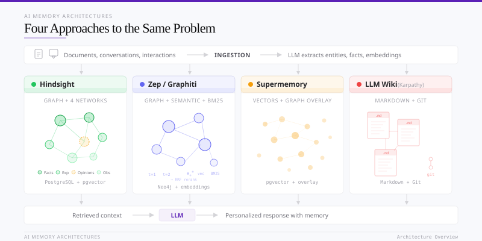
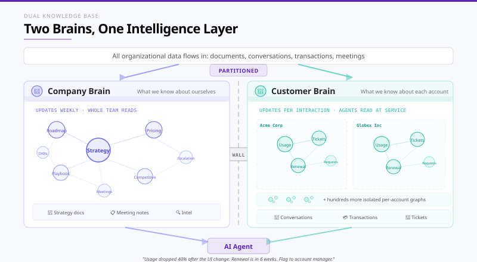

# Building a Company Brain

*Every AI agent forgets everything the moment the conversation ends. Here's how to give yours forever memory, the institutional knowledge, customer context, and hard-won lessons your team already has, plus the four systems making it possible.*

*Applied AI Field Guide · April 2026 · John Renaldi, Professor, Northwestern University · EIR, Techstars Chicago*

---

## The Problem: AI Has No Memory

Every large language model shipped today is stateless. Think of it as Groundhog Day flipped on its head. And yes, I realize I'm dating myself here. Half my students at Northwestern give me blank stares when I reference Bill Murray movies, so pick whichever of these lands for you. In *Groundhog Day*, Bill Murray's Phil Connors wakes up reliving the same day while everyone around him resets. In *Edge of Tomorrow*, Tom Cruise does the same thing with aliens and a better tagline ("Live. Die. Repeat."). Either way, in our version your *user* is the one who remembers every previous conversation, and your *AI* is everyone else, waking up each session with no idea who they are. When a conversation ends, the model retains nothing. It does not remember that your user prefers metric units, that a pricing tier changed last Tuesday, or that three support tickets this week all trace back to the same broken API endpoint. The next session starts from zero. This is not a bug in any particular product; it is a fundamental property of transformer-based inference. The model processes a fixed context window of tokens and produces a response. Nothing persists.

If you are building an AI-native product, a copilot, an agent, a customer-facing assistant, this statelessness is the first serious engineering wall you hit. Your users will expect the system to know things: who they are, what they told it yesterday, how their situation has changed. Without memory, you don't have an intelligent product. You have a very expensive autocomplete that starts fresh every time.

The industry's attempts to work around this limitation have followed a predictable progression, each solving part of the problem while creating new ones.

**Stuffing the context window.** The simplest approach: just paste prior conversation history or relevant documents into the prompt. This works until it doesn't. Context windows have gotten larger (Claude and Gemini offer up to 1M), but they are still finite, and filling them is expensive. At up to $5 per million input tokens for a frontier model, a product that injects tens of thoursands of tokens of history on every request is burning upwards of ~$0.75 per conversation before the user even asks a question. Worse, longer context doesn't mean better recall. Research consistently shows that models struggle with information buried in the middle of long contexts, the "lost in the middle" problem. And none of this addresses the core issue: you still have to decide *what* to stuff in. Someone or something has to curate.

**Retrieval-Augmented Generation (RAG).** The current industry default. You chunk your documents, embed them as vectors, store them in a database like Pinecone or Weaviate, and at query time you retrieve whichever chunks are mathematically closest to the user's question. This works for stable reference material, a product FAQ, a technical manual, but it has three specific failure modes that become deal-breakers the moment you try to build anything that genuinely *knows* things.

**1. It has no concept of time.** This is what engineers call a *temporal* failure. "Temporal" just means anything having to do with time: when a fact was true, when it changed, when it stopped being true. A Slack message from 2023 saying a feature is deprecated sits at the same structural level as a press release from last week announcing that feature's relaunch. The vector store retrieves both, and when new information contradicts what the system already stores, a vector database just keeps both versions. There is no mechanism to invalidate the old fact, flag the contradiction, or maintain a history of how the truth changed over time. The model has to guess which one is current. The system gets noisier, not smarter, with every new document you feed it. Keep the word *temporal* in mind. It comes back later in this post when we look at how one of these systems solves exactly this problem.

**2. It only sees fragments, not the whole picture.** RAG retrieves isolated text chunks based on similarity, which breaks any question that requires seeing a document or a conversation as a complete unit. Ask "what were the five biggest issues from our last customer call with John?" and vector search will return whichever chunks look most similar to "biggest issues," maybe the right ones, maybe not, with no mechanism to rank, count, or aggregate across the full transcript. The same limitation cuts the other way across documents: it cannot connect a sales call transcript where a prospect mentioned budget constraints, to that prospect's company just raising a Series B, to the pricing proposal your team sent last Friday. Those cross-document connections and within-document aggregations require entity extraction, relationship mapping, and awareness of document-level structure, things that a flat list of vector embeddings simply does not provide.

**3. It has no concept of authority.** A signed CEO memo and a random Slack message from an intern sit at the same structural level in a vector store, ranked only by how closely their text matches the query. There is no notion of "this source is canonical," "this author is authoritative," or "this document was approved by Legal." For consumer products this is annoying. For regulated industries, financial services, healthcare, legal, it is a non-starter, because the compliance posture of the entire system depends on being able to say *which* version of a fact the model relied on, and whether that source was one the company endorses. We come back to this in the compliance section later in the post.

**Fine-tuning.** You can bake knowledge directly into model weights through training. But fine-tuning is slow (hours to days), expensive (hundreds to thousands of dollars per run), and static. The moment a fact changes, the model is wrong until you retrain. For anything that requires up-to-date knowledge, which is most real products, fine-tuning is a blunt instrument.

These are not just engineering inconveniences. They cap what AI products can actually become.

---

## Enter the Second Brain

The cleanest articulation of what comes next, and why every serious AI-native organization needs it, comes from outside the foundational AI labs. In a March 2026 essay, Block (the payments company formerly known as Square) laid out a vision for what they call the ["intelligence-first" organization](https://block.xyz/inside/from-hierarchy-to-intelligence), one where AI doesn't just assist workers but assumes the coordination functions that management hierarchies were originally built to perform. The argument is that most companies are using AI to make the existing structure work slightly better, when the real opportunity is to replace what the structure does.

> "Most companies are focused on AI as a productivity enhancer. Few are focused on the potential of AI to change how we work together."
> Block, "From Hierarchy to Intelligence" (March 2026)

For that to work, Block argues, a company needs two things: 1) a "world model" of its own operations and 2) a customer signal rich enough to make that model useful. The world model is not a dashboard or a data warehouse, it is a continuously updating representation of what the organization knows, maintained by AI rather than by layers of human management. And the customer model is not a CRM record, it is a living understanding built from **every** interaction and transaction, compounding over time.

> "A world model that can't touch the world is just a database."
> Block, "From Hierarchy to Intelligence" (March 2026)

**What Block is describing has a name: a second brain.** A second brain is a persistent, structured layer of memory that sits between an organization's raw systems of record and the agents acting on its behalf. It remembers the facts, decisions, relationships, and context that accumulate from how an organization actually works, what the customer said on last week's call, which internal debate settled the pricing change, how the onboarding playbook has evolved, who owns what. 

Block is the cleanest articulation, but it is not a lonely voice. Over the past eighteen months, the CEOs of the largest enterprise AI vendors, the founders building the underlying infrastructure, and the academic researchers working on agent memory have all arrived at the same conclusion from different directions. The vocabulary differs (world model, enterprise context, knowledge graph, ontology, memory layer), but the shape of the thing they are pointing at is the same.

Microsoft built the same idea into Work IQ as a first-class pillar, framing the intelligence layer behind Microsoft 365 Copilot as Data, Memory, and Inference. Microsoft Research's GraphRAG paper showed that swapping vector RAG for a structured knowledge graph produces measurable gains in reasoning accuracy over private documents. 

This is where the memory problem becomes a strategy problem. You cannot build a world model on a stateless system. You cannot compound customer understanding when every session starts from zero. The workarounds covered in the previous section, context stuffing, vanilla RAG, fine-tuning, were built for information retrieval, not for the kind of persistent, evolving knowledge a second brain requires. As Block puts it: "That understanding compounds every second the system operates." But only if the system actually remembers.

The limitations we just covered, temporal blindness, relational flatness, contradiction accumulation, and update latency, are precisely what a new generation of AI memory architectures are designed to solve. The goal is a system that genuinely learns from every interaction, connects information across sources, knows when facts have changed, and delivers the right context to the model on every query without requiring you to engineer retrieval logic from scratch.

This report evaluates four approaches to building a second brain. Three are purpose-built memory engines (Hindsight, Zep/Graphiti, and Supermemory), each with a different architectural philosophy. The fourth is Andrej Karpathy's LLM Wiki pattern, a radically simpler alternative that trades infrastructure for transparency. Whether you are a solo founder prototyping your first AI feature or an engineering team scaling to millions of users, the choice between these architectures will shape what your product can actually do.

---

## What a Second Brain Is Not

One distinction is worth nailing down before we go any further, because it trips up almost every conversation about AI memory. A second brain is not a semantic data layer, and the two solve genuinely different problems.

A second brain remembers. It holds the facts, decisions, relationships, and context that accumulate from how an organization actually works, what the customer said on last week's call, which internal debate settled the pricing change, how the onboarding playbook has evolved, who owns what. Ask it "what did the CEO decide about pricing last Tuesday?" and it has a place to look.

A semantic data layer does math on live data. Think of it as a shared dictionary sitting between your company's database and anyone asking questions of it, making sure that words like "revenue," "active customer," and "churn" mean the exact same thing whether a person, a dashboard, or an AI agent is asking. Ask it "what was Q3 revenue by segment?" and it runs the numbers against the actual database and gives you the same answer every time, based on the data as it stands right now. Ask a second brain the same question and it will either guess or give you a stale answer from the last time it happened to see the numbers.

Both sit between the LLM and the source systems, both claim to ground agents, and both borrow vocabulary from the same academic neighborhood. But they ingest different things, produce different outputs, and fail in different ways. The cleanest way to think about it is layered: underneath everything are the systems of record (CRM, ERP, ticketing, documents, calendars, email); on top of those, a serious organization actually needs two different intelligence layers, a semantic data layer for quantitative reasoning over structured data, and a second brain for qualitative reasoning over everything else. The four systems in this post sit squarely in the second category. If your real problem is dashboard-style analytical reasoning over structured tables, none of them will solve it, and you should be looking at a semantic layer instead. The two worth studying first are [OpenAI's in-house data agent](https://openai.com/index/inside-our-in-house-data-agent/), which is not a product you can buy but is the clearest published reference architecture for what a serious analytical agent looks like inside a company, and [Dash](https://github.com/agno-agi/dash) from Agno, the open-source version of that same pattern built around six layers of grounded context and a self-learning loop that improves with every query.

This also matters when you start looking at vendors, because some ship both layers under one roof. Microsoft Work IQ bundles Memory (second brain) and Fabric IQ (semantic data layer); that is Microsoft's architectural position, that a serious enterprise needs both, and they should be coordinated. Palantir Foundry takes the same posture. Glean is mostly second brain. Zep, Hindsight, Supermemory, and the LLM Wiki are purely second brain. A reader evaluating Work IQ or Palantir should understand they are getting two different things, not one.

---

## Building AI That Remembers Everything Your Team Knows

The end state these architectures are reaching for is not a better search mechanism. It is a shared intelligence that absorbs every conversation, document, and decision your team produces, and gets meaningfully smarter with each one. Every call (transcript) and email teaches it something about our customer. Every support ticket refines its understanding of where the product breaks. Every Slack thread, every strategy memo, every onboarding session feeds a system that anyone on the team can query and that returns answers grounded in the full history of what the organization actually knows.

But the real power is not retrieval. It is pattern recognition. A system with structured memory over thousands of interactions can surface things no human would catch: that three unrelated customers churned after the same onboarding step, that a pricing objection from enterprise prospects correlates with a specific competitor being in the deal, that the engineering team's velocity drops every time a particular type of requirement comes from a particular stakeholder. These are not insights anyone asked for. They are patterns buried across hundreds of documents, conversations, and data points that only become visible when a system holds all of it in structured, queryable memory, and has the reasoning capacity of a large language model sitting on top.

The more people contribute, the more aware the system becomes. The more aware it becomes, the more valuable each contribution is. A new hire's onboarding notes improve the system's understanding of where documentation gaps exist. A founder's board prep sharpens the model's grasp of strategic priorities. A customer success manager's call summary teaches the system something about retention risk that the product team needs to hear. Nobody has to route that information manually, the memory layer connects it. 

---

## Architecting the Dual Knowledge Base: The Company Brain and the Customer Brain

Block's "world model" concept splits naturally into two distinct knowledge bases that serve different purposes, update at different rates, and have different access patterns. The **company brain** is what your organization knows about itself: what you are building, what you have decided, what you know about your market, who does what. It changes weekly. The whole team reads from it. It is fed by internal documents, meeting notes, strategy discussions, and competitive research. The **customer brain** is what your organization knows about each customer: what they have told you, what they have done, how their situation has changed. It changes with every interaction. Agents read from it at the point of service. It is fed by conversations, transactions, emails, support tickets, and usage data.

Most organizations are only thinking about one of these, or conflating them. Building both, and keeping them cleanly separated, is what makes a functioning intelligence layer possible. The reason separation matters is practical: an external customer service agent must never be permitted to retrieve or surface details from internal profitability strategy documents, unreleased product roadmaps, or candid employee correspondence. Strict logical and physical partitioning is mandatory.

> **Foundational Design Principle:** Do not expose raw operational memory as the customer-facing source of truth. Regardless of which runtime memory system powers the internal knowledge base, the external customer-facing layer must be explicitly governed. Operational memory systems ingest noisy, contradictory, and evolving internal correspondence; surfacing this raw substrate to customers, even through a well-tuned retrieval pipeline, risks exposing draft reasoning, internal disagreements, or stale facts that have not yet been invalidated. The external knowledge base must either be a separately partitioned memory instance with strict ingestion controls, or a compiled canonical layer where knowledge is reviewed and promoted before publication.

### Meet the Four Systems

Four shipping systems already commercialize this dual-brain architecture, and each one arrives from a different engineering philosophy. Three are purpose-built memory engines that run as infrastructure behind your agents. The fourth is a markdown-and-Git pattern you can implement without any database at all.

**Hindsight** is the open-source option. Released by Vectorize under an MIT license, it is a four-network operational memory substrate, facts, actions, beliefs, and observations stored in strictly separated layers, running on standard PostgreSQL. Retrieval is hybrid by design: keyword, semantic vector, and graph traversal searches run in parallel, and the results are merged into a single ranked set before being handed to the model. Organizations host it inside their own environment or can pay for a hosted solution.

**Zep** is the temporally precise option. Powered by the open-source Graphiti engine, it is a managed bi-temporal knowledge graph that gives every user a dedicated graph instance and stamps four timestamps on every fact, separating when something became true in the world from when the system first learned it. 

**Supermemory** is a fully managed option. It bundles a full context stack with native connectors to Google Workspace, Notion, and GitHub, plus a drop-in proxy that turns any LLM application into a persistent-memory application by swapping a single URL. A free tier and a $19-a-month developer plan make it the fastest path to working memory in the category.

**Karpathy's LLM Wiki** is the radically simpler option. Interlinked markdown files, maintained by the language model itself and version-controlled in Git. No database, no vector store, no proprietary graph engine. Every fact the system holds is a file a human can open, read, and edit directly.

### How Each System Implements Isolation

**Hindsight** achieves isolation at the foundational level through Memory Banks. A memory bank functions as an entirely isolated storage container; retrieval and reflection operations executed within one bank have zero visibility into the data structures of another. The organization would instantiate one bank dedicated to customer-facing data and a separate bank for internal operations. Within the internal operational bank, Hindsight's tagging system provides secondary logical partitioning, allowing sensitive executive correspondence to be tagged and restricted from general employee agents. Crucially, Hindsight allows administrators to program distinct behavioral directives per bank, the external bank's reflection engine can be constrained with high literalism to prevent speculative hallucinations, while the internal bank can be authorized to aggressively synthesize speculative opinions regarding organizational efficiency.

**Zep** enforces data isolation structurally: every user in the system receives their own dedicated knowledge graph. This is not a filtered view on a shared database; each User Graph is a physically separate graph instance containing only that user's entities, relationships, and facts. This per-user graph architecture eliminates cross-customer data leakage by design rather than by access control policy. For the dual knowledge base requirement, the organization would maintain per-customer User Graphs for the external system, each structurally isolated from one another and from internal data. For shared, non-user-specific knowledge, such as product documentation, company policies, or internal operational data, Zep supports generic graphs that exist independently of any user.

**Supermemory** manages isolation primarily through Container Tags, which function as project scopes. When internal documents are ingested through the enterprise connectors, they must be rigorously assigned an internal container tag. The external AI agent is subsequently initialized and locked to only retrieve vectors possessing external tags. While effective, this logical separation within a unified managed database carries a marginally higher theoretical risk of misconfiguration compared to physically partitioned infrastructure.

### What This Looks Like in Practice

Consider a B2B SaaS company where the company brain holds the product roadmap, pricing logic, onboarding playbook, and support escalation rules, while the customer brain holds each account's usage patterns, feature requests, renewal date, and recent support tickets. An agent reading both can surface: "This customer's usage dropped 40% after the UI change shipped last month. They filed two tickets about it. Their renewal is in six weeks. Flag this to the account manager with a recovery plan." No human routed that information. No manager aggregated those signals. The two brains connected the dots.

### Alternatives Not Profiled Here

The four systems above represent the cleanest architectural philosophies in the builder-infrastructure category, but they are not the only shipping options. If you are evaluating the landscape before committing to one of the four, a few peer names are worth knowing about.

**Mem0** is the strongest direct peer to Supermemory for teams that want fast managed memory with stronger compliance paperwork (SOC 2, HIPAA-ready) out of the box. **Letta** (formerly MemGPT) takes the most provocative architectural position, the agent manages its own memory by reading and writing files through tool calls, with no separate database doing the work behind the scenes. **Cognee** is the credible alternative for teams that want a graph-based memory but do not want to hand-define the structure up front; it learns the schema from ingested data automatically. **XTDB v2** is not a memory engine but a database substrate, an open-source foundation with full timeline auditability, for teams who want to build their own memory layer rather than buy one. **Basic Memory** is the productized version of Karpathy's LLM Wiki pattern, right-shaped for personal or small-team knowledge bases.

A separate category (organizations that would rather extend a platform they already license, such as Microsoft 365, Palantir Foundry, or Glean, than build on developer infrastructure at all) gets its own treatment in the "If You'd Rather Extend Than Build" subsection later in this piece. Those products occupy a different shape from the four above and are the right place to look if your constraints point away from builder infrastructure entirely.

---

## Picking the Right System

We've now introduced the four systems and seen how each one handles the dual-brain isolation requirement. The next question is how to choose between them. Before the recommendations, it is worth understanding what these four agree on and where they diverge.

### What All Four Systems Solve

Every system addresses the same three core problems that vanilla RAG cannot: entity linking (knowing *who* or *what* a fact is about), temporal correctness (knowing *when* something was true), and context selection (knowing what to surface to the model without overwhelming it). The three purpose-built memory engines, Hindsight, Zep, and Supermemory, solve these with engineered pipelines and structured databases. Karpathy's LLM Wiki solves them with the language model itself, using markdown files and version control as the primitives.

### Key Differences

**Data Model and Internal Representation.** Hindsight, Zep, and Supermemory all go beyond "just vectors", they store structured facts, temporal metadata, and relationships. Hindsight explicitly separates objective facts, observations, beliefs, and summaries; Zep keeps bi-temporal facts with graph edges; Supermemory couples vectors with ontology-aware edges and versioned mutations. Karpathy's LLM Wiki stores interlinked text pages (markdown) and relies on an LLM to interpret and compile them rather than maintaining an explicit graph or hybrid index.

**How They Update.** The purpose-built systems are designed as "living memory", they ingest events, resolve entities, and support updates and contradiction handling automatically. Within this, philosophies diverge: Supermemory relies on aggressive, time-based "forgetting" and decay, permanently deleting ephemeral data once it expires. Zep uses explicit edge invalidation, preserving outdated facts in the graph with expiration timestamps to maintain a flawless historical audit trail rather than deleting them. Karpathy's model is file-centric and evolves through Git and the LLM's re-reading and compilation, which is simple and transparent but less automated for high-velocity streams.

**Compliance Readiness.** Zep ships with enterprise controls out of the box (SOC 2 Type II, bring-your-own-key encryption, role-based access control), making it the most ready for regulated industries like fintech, healthcare, and legal. Hindsight's compliance path is self-hosting: open-source MIT license, deploy inside your own environment, and layer on whatever controls you need. Supermemory's Enterprise tier supports SOC 2, HIPAA, and GDPR. Karpathy gives you full control (everything is files under Git) but has no built-in compliance features.

**Engineering vs. Operational Tradeoffs.** Karpathy's approach minimizes infrastructure and costs initially at the expense of built-in scaling, connectors, multimodal extraction, and enterprise controls. Conversely, Supermemory heavily bundles native data connectors (like Google Workspace, Notion, and GitHub) and multimodal extraction directly into its API, minimizing data pipeline engineering. Zep and Hindsight act more strictly as foundational memory and retrieval infrastructure, meaning engineering teams must often build or manage the pipelines that extract and feed documents into them.

### First-Pass Recommendations

The right memory architecture depends on three things: how big you are, what infrastructure you can run, and whether regulators are watching.

**Supermemory** is the fastest path to working memory. It is fully managed, comes with native connectors to tools like Google Workspace and Notion, and has a free tier. If you are a small team that needs memory working this week, not this quarter, start here.

**Hindsight** is for teams that need to own their infrastructure. It is open-source (MIT license), runs on standard PostgreSQL, and can be deployed entirely inside your own environment. Its four-network architecture separates facts from beliefs, which keeps retrieval clean as the volume of internal data grows. If you need self-hosted and want strong retrieval accuracy, this is the pick.

**Zep** is for teams where compliance is a hard requirement. Its bi-temporal knowledge graph tracks when every fact was true and when the system learned it, which means you can reconstruct exactly what the AI knew at any point in time. It ships with SOC 2, BYOK encryption, and role-based access control. If you are in fintech, healthcare, or any regulated space, Zep is the most directly aligned option.

**Karpathy's LLM Wiki** is for knowledge that humans need to read and edit directly. There is no database. The model reads documents, writes markdown files, and maintains them with version control. You can open the knowledge base in a text editor and see exactly what the AI believes. If your priority is transparency over automation, and your data volume is manageable, this is the simplest approach.

Whichever system you choose, the important thing is to start feeding it now. These knowledge bases are compounding assets. Every customer interaction, every internal decision, every document ingested makes the system smarter. After three months of consistent use, you have a knowledge layer built from proprietary data that no competitor can replicate, because the value is in the accumulated understanding, not the underlying technology.

### If You'd Rather Extend Than Build

The four systems above are all developer infrastructure. You choose one, wire it into your stack, and accumulate memory against it yourself. That is the right path if you are a startup, an engineering team with capacity, or an organization whose current stack does not already contain a second-brain-shaped product. For organizations that would rather extend something they already license than build from scratch, the same dual-brain pattern ships off the shelf in three places. These are not part of the main four because they occupy a different category, but they are the first places to look if your constraints point away from developer infrastructure.

**Microsoft Work IQ** is the default for any organization already running Microsoft 365. It delivers both brains without adding a new vendor. The semantic index updates continuously as content changes. Its strongest advantage is incumbency: the incremental cost to extend is lower than any alternative because you already own the license.

**Glean** is the cleanest third-party example of the enterprise-graph pattern outside the Microsoft ecosystem. It ships a permission-aware graph with entity linking across every major system of record, a unified chat surface, and a developer platform with REST APIs and toolkits for LangChain, CrewAI, and OpenAI Assistants. The architectural limitation is freshness: Glean crawls each datasource every 24 hours, augmented by webhooks on the most active sources (Slack, Gmail, Confluence). For a world model that is supposed to compound continuously, a 24-hour window is a real constraint, though in practice the webhook coverage closes most of the gap on the sources that change fastest. Glean is the right pick for organizations that have standardized on it but do not run Microsoft 365 as their primary collaboration stack. For most M365 shops, Work IQ dominates on nearly every dimension because the incremental cost to extend is so much lower.

**Palantir Foundry + AIP** is the only vendor in either category that ships a product built around what computer scientists call an *ontology*. In plain language, an ontology is a formal model of the things your business cares about (customers, contracts, aircraft, patients, shipments), where each thing is defined as an object with properties, relationships to other objects, and a list of actions you are allowed to take on it. Instead of storing knowledge as loose documents and text chunks, Foundry insists you first define this structured world model, then builds retrieval, agents, and applications on top of it. AIP, Palantir's AI layer, retrieves these structured objects rather than text chunks, a pattern Palantir calls Ontology-Aware Generation. Asking "what is this customer's renewal risk?" does not pull back passages that happen to contain the word "renewal"; it pulls back the customer object itself, already connected to its contract, usage, support history, and open opportunities. Foundry Branching lets teams test changes to the ontology in isolated branches before merging them into the main model, the same way software engineers test code in a Git branch before merging to main. Marking-based access control plus project isolation give industrial-strength tenant separation. Its weakest dimension is time-awareness at the ontology level: Foundry has audit logs, dataset versioning, and branch-and-merge workflows, but it does not ship the temporal split that Zep makes central, where the system separately tracks when a fact became true in the world from when Foundry first learned about it. Popular in regulated industries (defense, financial services, healthcare) that can tolerate the lock-in in exchange for the depth of the modeling layer.

One thing to name clearly: Work IQ and Palantir both ship a semantic data layer alongside the second brain (Fabric IQ for Microsoft, the AIP query layer for Palantir). That is a feature if you need both layers, and a limit if you only wanted memory.

### Priority-Based Decision Framework

1. **Would you rather extend an enterprise platform you already license than build from scratch?** If yes → Which one are you standardized on? **Microsoft 365** → **Work IQ**. SharePoint Knowledge Agent as the company brain, Microsoft Fabric plus federated Graph connectors as the customer brain, Copilot Studio as the agent surface. Lowest incremental cost of anything in this framework because you already own the license. **Palantir Foundry (or a regulated industry that wants ontology-aware retrieval)** → **Foundry + AIP**. Deepest modeling layer in the category, Ontology-Aware Generation, branch-and-merge governance. **Not on Microsoft 365 and not Palantir-shaped** → **Glean**. Permission-aware enterprise graph with a developer API; 24-hour crawl plus webhooks on the fastest-moving sources. If no (you want to build and own the stack) → continue to question 2.

2. **Is speed to first working product your top constraint?** If yes → Supermemory. Managed stack, native connectors, free tier to $19/mo. Swap one URL and you have memory.

3. **Are you in a regulated industry (fintech, healthcare, legal)?** If yes → Does the regulation require bi-temporal auditability (proving what the AI knew and when)? Yes → Zep (native audit-trail via four-timestamp model, SOC 2, BYOK, 7-year cold storage). No → Hindsight (MIT license, self-host in VPC, PostgreSQL-level append-only compliance).

4. **Is the knowledge base primarily for agents, or do humans need to read and edit it directly?** Humans → LLM Wiki. 100% readable markdown, Git audit trail, zero infrastructure. Agents → continue to question 5.

5. **Is deployment sovereignty (self-hosted, full VPC control) critical?** If yes → Hindsight. Open-source MIT, standard PostgreSQL, deploy entirely within your VPC. If no → Zep. Enterprise RBAC, per-user graph isolation, sub-300ms retrieval.

### How the Right Choice Changes as You Scale

| Stage | Primary Constraints | Best Fit | Why |
|-------|--------------------|---------|----|
| **Seed Stage** | Engineering bandwidth, cash burn, rapid iteration | **Supermemory** (external) / **LLM Wiki** (internal) | Instant functionality via managed APIs. LLM Wiki provides zero-cost internal alignment. |
| **Mid-Stage** | Data volume scaling, vendor lock-in avoidance, deployment sovereignty | **Hindsight** | Open-source, standard PostgreSQL, full VPC hosting. Noise reduction at scale. |
| **Late-Stage** | Complex data integration, granular access control, high-throughput retrieval | **Zep (Graphiti)** | Enterprise RBAC, bi-temporal precision, sub-300ms latency on scalable graph databases. |
| **Enterprise Incumbent (M365)** | Low appetite for new vendors, existing M365 license, continuous semantic indexing needed | **Microsoft Work IQ** | SharePoint Knowledge Agent + Fabric + federated Graph connectors ship both brains off the shelf. Lowest incremental cost because the license is already paid. |
| **Enterprise Incumbent (non-M365)** | Already standardized on a single enterprise search layer; want a permission-aware graph and a developer API | **Glean** | Permission-aware enterprise graph with entity linking across every major system of record. 24-hour crawl plus webhooks on the highest-velocity sources. |
| **Regulated / Modeling-Heavy Enterprise** | Defense, financial services, healthcare; need a structured organizational world model and industrial-strength isolation | **Palantir Foundry + AIP** | Ontology is a first-class entity graph; AIP uses Ontology-Aware Generation (structured objects, not text chunks). Foundry Branching for safe ontology evolution. |

---

## How the Four Systems Differ in Architecture and Capability

To architect a dual-knowledge base capturing every piece of organizational data, the selection of the underlying memory engine must be dictated by how the system handles the physical realities of data velocity and contradictory inputs.

| Architectural Dimension | Hindsight | Zep (Graphiti) | Supermemory | LLM Wiki (Karpathy) |
|------------------------|-----------|----------------|-------------|---------------------|
| **Core Epistemic Structure** | Four distinct networks separating facts, actions, observations, and subjective opinions | Tripartite bi-temporal graph tracking event time and ingestion time | Five-layer context stack with automated profile generation | Interlinked, human-readable markdown file repository |
| **Data Ingestion Methodology** | Asynchronous extraction of facts into explicit categorical pathways | Incremental processing of raw episodes into semantic and community nodes | Automated multi-modal processing via native application connectors | Synchronous, upfront reading and explicit rewriting of text files |
| **Conflict & Contradiction Resolution** | Autonomous background reflection to update confidence scores of beliefs | Non-lossy temporal edge invalidation preserving historical graph states | Designation of replacement facts via isLatest tags and "Update" edges | Manual LLM linting and explicit text revisions |
| **Noise Filtering Strategy** | Consolidation of redundant facts into preference-neutral entity observations | Leiden algorithm clustering into macro-level community summaries | Aggressive time-based decay and autonomous forgetting of ephemeral data | Human curation of raw sources prior to LLM compilation |
| **Retrieval Engine** | Hybrid: semantic, BM25, graph, and temporal search with reranking | LLM-free hybrid: vectors, keywords, and graph traversals | Hybrid semantic and keyword search with contextual chunk reranking | Sequential reading of a centralized index file to locate exact text documents |
| **LLM Calls Per Ingestion** | 2–3 calls | 4–6 calls | 2–3 calls | 1 large call (high token count) |

### LongMemEval: The Shared Benchmark

LongMemEval is the agent memory field's shared benchmark for multi-session question answering over long dialogue histories. It is the only public evaluation all three runtime systems report against, though on different backbone models.

**A note on the backbones.** Zep publishes only a GPT-4o score (71.2%) and has not released a Gemini-3 Pro number, so the comparison below is not strictly apples-to-apples. Hindsight and Supermemory both publish Gemini-3 Pro results (91.4% and 85.2%), which is the closest thing to a direct head-to-head in the space. Backbone choice moves scores meaningfully: Supermemory gained 3.6 points moving from GPT-4o to Gemini-3 Pro (81.6% → 85.2%), and Hindsight gained 7.8 points moving from OSS-20B to Gemini-3 Pro (83.6% → 91.4%). Treat any cross-vendor benchmark claim with skepticism unless the backbone model and evaluation harness are explicitly matched.

### How Memory Gets Into the Prompt at Runtime

A critical capability shared by all three runtime memory systems, and absent from the LLM Wiki, is the per-query context enrichment API. This pattern allows developers to call a single endpoint with every user prompt, automatically retrieving the most relevant facts, entity context, and historical memories from the knowledge graph and injecting them into the language model's context window. This eliminates the need for the agent to independently search, filter, and assemble context; the memory system handles orchestration automatically.

**Zep** provides two tiers of this capability. The high-level `thread.get_user_context()` method accepts a thread identifier and automatically analyzes the most recent messages to determine what historical data from the entire User Graph is most relevant. It returns a structured Context Block containing: a narrative user summary synthesizing the user's profile, preferences, and history; relevant facts with associated date ranges indicating their temporal validity periods; and a formatted text string designed for direct injection into the LLM's system prompt. This operates at P95 latency under 200 milliseconds. For developers requiring finer control, `graph.search()` accepts a query string, user identifier, and scope parameters and returns granular search results with relevance scores, supporting reciprocal rank fusion, maximal marginal relevance, and cross-encoder reranking.

**Hindsight** achieves per-query enrichment through its `recall()` primitive. The developer passes a bank identifier and the user's query, along with optional parameters controlling search depth, maximum return tokens (2,048 to 8,192 tokens), memory type filters, and whether to include verbatim source chunks. The `recall()` operation executes all four parallel retrieval strategies, semantic, BM25, graph traversal, and temporal, fuses the results, and returns ranked facts calibrated to fit within the specified token budget. For applications requiring reasoned synthesis, the `reflect()` operation wraps `recall()` with the bank's configured dispositions, returning a disposition-aware reasoned response rather than a list of retrieved facts.

**Supermemory** packages this pattern as the Infinite Chat API, which accepts a conversation history and injects only the memories needed for the current turn directly inline. Supermemory further reduces integration friction through its Memory Router Proxy, a zero-code-change integration pattern where the developer simply swaps the LLM provider's base URL for Supermemory's proxy endpoint. The proxy intercepts the API call, retrieves relevant context from both the stateful memory layer (extracted atomic facts that evolve over time) and the stateless document index (raw content chunks preserved for traditional RAG retrieval), enriches the prompt, and forwards the request to the original LLM provider transparently.

**A Critical Retrieval Tradeoff: Single-Shot vs. Agentic.** Zep's query path is explicitly non-agentic: one search, one rerank, one context block. This makes latency predictable (P95 under 200 milliseconds) but means the system cannot iteratively refine its search if initial results are insufficient. Supermemory follows a similar single-pass pattern through its proxy architecture. Hindsight's `reflect()` operation, by contrast, is the only retrieval mechanism among the three that can loop. The LLM agent evaluates whether the initial recall results are sufficient; if not, it can run additional search iterations with refined queries, applying disposition-aware reasoning at each pass. Simple queries resolve in a single pass, while complex queries may take three to five iterations.

---

## Deep Architectural Analysis

Each system deploys a distinct data model to extract entities, map relationships, and manage the lifecycle of information as it evolves. The fundamental differences lie in how they structure this model and how they resolve the inevitable contradictions that arise when an AI ingests massive volumes of correspondence.

### The Biggest Design Choice: Graph-First vs. Embedding-First

Before examining each system individually, it is essential to name the deepest architectural divide among them: whether the knowledge graph or the vector embedding serves as the primary knowledge representation. This choice cascades into every other design decision.

**Zep is unambiguously graph-first.** Entities and their relationships form the structural backbone of all knowledge. Vector embeddings exist to find relevant nodes and edges, but the graph structure itself is what encodes knowledge. This means Zep excels at multi-hop reasoning, traversing from a person to their company to that company's competitors to regulatory filings about those competitors, because these traversals are native graph operations. The tradeoff is ingestion complexity: extracting entities and relationships from unstructured text requires multiple LLM calls per episode, adding cost and latency during ingestion. Zep's multi-backend support, the Graphiti engine can run on Neo4j, FalkorDB, and Amazon Neptune, allows enterprises to choose graph storage that aligns with existing infrastructure.

**Supermemory is embedding-first with graph semantics layered on top.** Atomic memories are stored as vectors; the Update, Extend, and Derive relationships form a lightweight graph overlay rather than a full property graph. This makes ingestion faster and the system simpler to operate, but multi-hop reasoning is inherently weaker, the system is optimized for understanding a single entity (typically the user) and their evolving context rather than mapping complex relational networks across many entities. For use cases requiring the agent to reason across relationships between clients, products, regulatory filings, and organizational hierarchies, an embedding-first system will struggle to connect the dots that a graph-first system traverses natively.

**Hindsight occupies a pragmatic middle ground.** Its knowledge graph lives natively in PostgreSQL tables rather than a dedicated graph database, with entities, entity links, and memory units stored relationally. The four memory networks provide semantic structure, and retrieval relies on vector similarity and BM25 alongside graph traversal. The tradeoff is that graph traversal in SQL is inherently less expressive than in a purpose-built graph database like Neo4j, which limits the depth and complexity of multi-hop queries. For most operational memory use cases this constraint is immaterial.

**Karpathy's LLM Wiki rejects both paradigms entirely.** There are no embeddings and no formal graph. Wiki-links between markdown pages create an implicit graph that the language model navigates by reading an index file and following hyperlinks. This works because the language model itself performs the equivalent of embedding and graph traversal at inference time using its language understanding. The limitation is that this approach cannot scale beyond what fits in the language model's context window.

### Hindsight: Four Memory Layers Searched in Parallel

**Overview:** Storage on PostgreSQL + pgvector. Four-strategy hybrid retrieval plus agentic reflect loop. 64.1% on the BEAM benchmark (58% ahead of the next system). MIT open-source license.

Hindsight, engineered by Vectorize, is designed around a core insight: AI agents fail when they can't distinguish between what actually happened and what the agent inferred from what happened. If an agent ingests an email stating a customer is unhappy with pricing, and then infers that the customer is a churn risk, a traditional vector database stores both the email and the inference as structurally identical facts.

Hindsight solves this by requiring all ingested content to be parsed and strictly partitioned into a four-network architecture:

- **The World Network** is dedicated exclusively to storing objective, verifiable facts about the external environment, a client's contract renewal date, an employee's organizational role.
- **The Experience Network** operates as an immutable autobiographical ledger, recording the agent's own historical actions, tool executions, and direct interactions with users.
- **The Opinion Network** holds subjective judgments and evolving beliefs. Entries are coupled with explicit mathematical confidence scores that dynamically adjust as new, corroborating, or contradictory evidence is ingested.
- **The Observation Network** acts as a preference-neutral consolidation layer. Rather than retrieving hundreds of redundant emails about a specific client, the system continuously runs background synthesis to distill those raw facts into a single, cohesive entity profile.

The architecture relies on three core primitives. The **Retain** operation governs the ingestion of raw correspondence. The **Reflect** operation represents Hindsight's mechanism for autonomous learning, running in the background, the Reflect agent evaluates newly retained facts against existing knowledge, consulting user-curated mental models, updating confidence scores, and consolidating noise into clean entity summaries. Crucially, the Reflect operation is governed by configurable **dispositions**, three reasoning traits scored on a one-to-five scale: *Skepticism* controls whether the agent trusts incoming information at face value or actively questions claims. *Literalism* determines whether the agent interprets content flexibly or takes statements at strict face value. *Empathy* governs whether the agent focuses purely on factual content or also considers emotional context. These dispositions can be configured independently per memory bank. The **Recall** operation executes a multi-strategy hybrid retrieval process, simultaneously running dense semantic search, BM25 exact keyword search, knowledge graph traversal, and temporal reasoning. The results from these four parallel retrieval pipelines are fused and evaluated by a cross-encoder reranker before being delivered to the language model.

This rigorous separation of evidence from inference, combined with parallel retrieval, allows Hindsight to achieve an industry-leading 91.4% accuracy on the LongMemEval benchmark. More significantly, Hindsight leads the BEAM benchmark, which specifically evaluates memory systems handling conversations ranging from 100,000 to 10 million tokens, with a score of 64.1%, 58% ahead of the next-closest system.

The Opinion Network's traceability further distinguishes Hindsight for environments requiring explainable reasoning. Each belief generated by the Reflect operation carries explicit "based_on" linkages to the specific facts that informed it, enabling compliance officers or auditors to trace any agent conclusion back to its evidentiary foundation.

**Primary Limitation:** Hindsight is an operational memory substrate, not a canonical publishing layer. It does not natively produce human-readable, curated knowledge artifacts. Organizations requiring inspectable, editable canonical documentation must build that output layer separately.

### Zep and the Graphiti Engine: A Time-Aware Knowledge Graph

**Overview:** Storage on Neo4j / FalkorDB / Neptune + vector index. Single-shot retrieval (cosine + BM25 + graph traversal) at P95 under 200ms. Four timestamps per fact: valid_at, invalid_at, created_at, expired_at. SOC 2 Type II, BYOK, BAA, 7-year cold storage.

Zep makes a profound structural bet on temporal knowledge graphs, powered by its open-source Graphiti engine. In a standard knowledge graph, information is stored as triplets comprising two entity nodes connected by an edge representing their relationship. However, when an organization feeds every piece of daily correspondence into a system, relationships constantly mutate. A vendor might be categorized as an active partner in a January contract but flagged as terminated in an October email thread.

Zep resolves the problem of mutating relationships through explicit **bi-temporal modeling**. Every edge within the Zep knowledge graph is augmented with validity intervals, tracking both Event Time and Ingestion Time. Event Time records the exact chronological moment a fact became true in the real world. Ingestion Time records the exact millisecond the system observed the data, preserving a flawless transaction lineage.

When Zep ingests contradictory correspondence, it does not rely on a language model to arbitrarily rewrite the graph, nor does it permanently delete the outdated information. Instead, Zep executes **automatic fact invalidation**. The outdated edge is marked with an invalidation timestamp but remains permanently preserved within the graph architecture. This non-lossy mechanism allows the AI to reason over the evolution of a customer's state, effortlessly answering queries requiring historical reconstruction.

The Zep architecture manages the influx of raw data by organizing it into a tripartite hierarchical structure:

1. **The Episodic Subgraph** acts as the immutable ground truth, storing raw conversational transcripts, emails, and documents exactly as they were ingested.
2. **The Semantic Entity Subgraph** extracts people, organizations, and concepts as nodes linked via temporal edges.
3. **The Community Subgraph** uses the Leiden algorithm to group highly connected entities into thematic clusters and generate high-level summaries.

Notably, Zep supports **domain-customizable ontologies**, allowing organizations to define custom entity types and edge types specific to their business (such as Clients, Deals, Products, or regulatory classifications). When a custom ontology is defined, Zep's extraction engine prioritizes those entity types during ingestion, resulting in higher-quality, more relevant graph construction.

During retrieval, Zep bypasses the latency of live LLM summarization. By leveraging Neo4j to execute hybrid searches combining vector embeddings, BM25 indices, and direct graph traversals, Zep achieves production-grade retrieval latencies of under 300 milliseconds.

**Primary Limitation:** Zep is not optimized for producing inspectable, human-curated canonical knowledge. Its strength is context assembly and temporal reasoning for agents and copilots. Organizations that need a browsable, editable knowledge base for human consumption must layer that capability on top of the graph infrastructure.

### Supermemory: A Managed Stack That Forgets on Purpose

**Overview:** Storage on PostgreSQL + pgvector via Cloudflare Workers. Single-shot retrieval via Memory Router Proxy (zero-code integration). 85.4% accuracy on LongMemEval. Native connectors to GDrive, Notion, GitHub. MCP distribution. Free tier: 1M tokens / 10K queries. Dev: $19/mo.

Supermemory diverges from the infrastructure-heavy deployments of Hindsight and Zep by engineering a fully managed, comprehensive context stack designed to eliminate the engineering friction of data pipelines. Operating on a foundation of Cloudflare Durable Objects and a proprietary PostgreSQL vector engine, Supermemory abstracts the complexities of chunking algorithms, embedding model selection, and graph database maintenance into a unified API.

The Supermemory architecture processes continuous ingestion through five distinct layers:

1. **Connectors**, native webhooks that automatically synchronize data streams from Google Workspace, Notion, GitHub, and enterprise communication channels in real time.
2. **Extractors**, a multi-modal processing engine applying optimized chunking strategies based on file type. Rather than blindly splitting software code by character count, Supermemory uses abstract syntax tree awareness to chunk code by logical functions and classes, while OCR and transcription engines process image and video correspondence.
3. **Memory Graph**, a custom vector graph engine with ontology-aware edges. Unlike Zep's domain-customizable ontology, Supermemory's relationship taxonomy is fixed to three predefined behaviors: *Update* (incoming fact contradicts existing knowledge), *Extend* (incoming data provides deeper context without contradiction), and *Derive* (autonomously inferred patterns connecting previously disparate facts).
4. **User Profiles**, a layer that continuously maintains deep conceptual models of specific individuals, bifurcating information into static traits (immutable facts like name or department) and dynamic context (ephemeral, episodic activity).
5. **Adaptive Forgetting**, Supermemory aggressively implements time-based forgetting and smart decay algorithms. If the system ingests an email stating a meeting is scheduled for Tuesday, the architecture autonomously expires and forgets that specific memory once the date has passed. Critically, this decay behavior is automatic and not directly configurable through the API. The only retention control available is the `isStatic` flag, which marks specific memories as permanent traits exempt from decay.

Supermemory's go-to-market strategy further differentiates it through aggressive adoption of the Model Context Protocol as its primary distribution layer. Rather than requiring developers to integrate a traditional API, Supermemory can be installed into Claude Desktop, Cursor, VS Code, and other MCP-compatible environments with a single command, enabling agents across different AI applications to share persistent memory without custom integration code.

**Primary Limitation:** Supermemory's managed simplicity trades direct control for convenience. At scale, organizations face increased vendor dependence, less visibility into retrieval internals, and reduced portability. The aggressive time-based decay mechanism introduces risk in environments where long-term data retention is required, as the system may autonomously purge information that proves relevant later.

### The LLM Wiki: Compiled Pages Instead of Live Search

Hindsight, Zep, and Supermemory all work by dynamically retrieving context at query time from structured databases. The LLM Wiki paradigm, articulated by Andrej Karpathy, takes the opposite approach: it abandons retrieval databases entirely in favor of upfront, persistent compilation.

The pattern treats the language model not as a search engine but as an autonomous research librarian. When a document is added to the raw source repository, the model reads it immediately and writes or revises human-readable markdown files, extracting core concepts, updating entity pages, and inserting hyperlink backlinks between related documents. Knowledge is compiled once and maintained incrementally. If an incoming document contradicts an existing fact, the model flags the contradiction in plain text at ingestion time, eliminating the need for conflict resolution algorithms at query time.

Navigation relies on two structured files rather than vector search. An `index.md` file serves as the master catalog of all wiki topics with one-line summaries, the language model reads it to decide which pages to consult. A `log.md` file operates as an append-only audit trail of every ingestion event and system update. Periodic linting passes scan the repository to find contradictions, delete stale claims, flag orphan pages, and recommend areas needing further research.

The advantage is absolute epistemic transparency: the entire knowledge base consists of standard markdown files that humans can open, read, and edit. The tradeoff is scalability. At roughly 100 articles and 400K words, this works well. Subjected to thousands of daily emails and support tickets, the architecture collapses, the language model would be stuck in a perpetual loop of reading, linting, and rewriting hundreds of files, burning tokens at unsustainable rates.

**Primary Limitation:** The LLM Wiki is designed for highly curated research corpora. It cannot handle continuous, high-velocity streams of operational data. There is also no way to programmatically query the knowledge base, it is LLM-or-nothing.

---

## When You Need a Separate Wiki Layer (And When You Don't)

The divide between wiki and graph approaches is not really about technology. It is about audience. A wiki stores knowledge as documents, articles a human can open in Obsidian, read in five minutes, and edit with a text cursor. A graph stores knowledge as nodes and edges, structured relationships a machine can traverse in milliseconds. One format is optimized for human browsing. The other is optimized for LLM querying. That single distinction explains most of the architectural tradeoffs in this report.

The runtime memory systems already replicate the two capabilities that make a separate wiki layer attractive:

**Source-level grounding.** All three runtime systems let agents bypass extracted facts and read the full original document on demand. Hindsight's `getDocument` tool retrieves raw files from object storage using the document_id returned alongside search results. Zep stores every ingested message as an immutable Episodic Node inside the graph, linked back to extracted facts via bidirectional MENTIONS edges, agents can pull the exact source text by UUID. Supermemory distinguishes raw "Documents" from extracted "Memories" and exposes a Get Document API that returns the complete original file.

**Cross-source synthesis.** Where the LLM Wiki compiles entity pages by having the LLM rewrite markdown, the runtime systems achieve equivalent synthesis automatically. Hindsight's Observation Network consolidates redundant facts into clean entity summaries. Zep's Community Subgraph clusters connected entities and generates thematic summaries. Supermemory's User Profiles layer aggregates static traits and dynamic context into continuously updated entity models. All three handle contradiction management natively rather than relying on periodic linting passes.

The decisive question is who consumes the synthesis. If the primary consumer is an autonomous agent, the runtime system's native capabilities are sufficient. A single runtime memory system with document grounding is the correct default for most teams, especially at the seed and mid-stage.

Add a separate compiled wiki layer only when a specific use case demands human-readable, directly editable canonical knowledge, customer-facing help centers, compliance manuals, onboarding handbooks, or architecture decision records, and the team has the discipline to maintain clear ownership boundaries between the runtime memory layer and the compiled layer.

---

## Compliance Deep Dive: Regulated Industries and Memory Auditability

For financial institutions, broker-dealers, and organizations operating under the jurisdiction of FINRA and the SEC, the deployment of AI memory systems transcends operational efficiency and becomes a matter of strict legal compliance. The mandate to feed "every piece of correspondence" into an AI fundamentally alters the regulatory landscape, as the resulting vectors, knowledge graphs, and synthesized entity profiles constitute regulated business records.

The preservation and accessibility of electronic records are governed by SEC Rule 17a-4 and FINRA Rule 4511. The SEC modernized Rule 17a-4(f) to introduce an Audit-Trail Alternative: firms may utilize dynamic electronic systems, provided the architecture maintains a comprehensive, time-stamped audit trail that captures every modification, records the identity of the actor, and guarantees the ability to perfectly recreate the original, unmodified record upon regulatory request.

Standard AI inference logs and traditional vector databases categorically fail to satisfy these tamper-evident, reconstructable standards.

### Compliance Snapshot

| System | Compliance Posture | Key Factor |
|--------|-------------------|------------|
| **Zep** | Strongest | Bi-temporal graph is a native audit-trail implementation. Four timestamps per fact. SOC 2 Type II, BYOK, 7-year cold storage. |
| **Hindsight** | Good | MIT license, self-host in VPC. PostgreSQL can be configured with append-only tables and cryptographic hashing. Epistemic traceability via Opinion Network. |
| **LLM Wiki** | Mixed | Git provides cryptographically secure, immutable audit trail. Perfect for internal documentation compliance. Cannot handle high-velocity correspondence at regulated scale. |
| **Supermemory** | Risk | Auto-forgetting and time-based decay autonomously delete records. In regulated industries with 3-6 year retention mandates, un-auditable deletion of business correspondence is a direct compliance violation. Enterprise tier adds SOC 2 and HIPAA, but the decay mechanism remains a structural concern. |

### Why Auto-Deletion Fails Compliance

When evaluated through the strict lens of SEC Rule 17a-4, the Supermemory architecture presents severe compliance vulnerabilities. The system is designed to autonomously expire and permanently purge facts it deems temporary or ephemeral to optimize retrieval speed.

In a regulated environment, the autonomous, un-auditable deletion of business correspondence or derived financial logic by an AI agent constitutes a direct violation of the mandated three-to-six-year record retention periods. Furthermore, relying on an `isLatest` tag to update and hide older facts without generating a cryptographically secure, time-stamped ledger of the alteration fails the reconstructability test of the Audit-Trail alternative. Without significant external wrapping and separate immutable archiving, Supermemory's consumer-oriented architecture is legally incompatible with FINRA environments.

### Knowing What the System Knows: Database-Level Audit Trails

Hindsight provides a much stronger foundation for regulatory compliance due to its open-source nature and reliance on PostgreSQL. Because the application layer is decoupled from specialized proprietary databases, enterprise engineering teams can enforce compliance at the infrastructure level, by configuring the underlying PostgreSQL database with strict append-only tables, cryptographic hashing for every transaction, and row-level security.

Beyond infrastructure, Hindsight's four-network architecture provides immense regulatory value through epistemic clarity. If an auditor challenges a recommendation made by the external agent, Hindsight's architecture allows compliance officers to definitively separate the objective World Facts the agent relied upon from the subjective Opinions it generated, explicitly tracing the confidence scores and the exact timestamps of when those beliefs evolved.

### Why Time-Aware Graphs Are Naturally Compliant

Among the dynamic retrieval systems evaluated, Zep is the most architecturally aligned with FINRA and SEC mandates. The bi-temporal knowledge graph operates as a native, inherent implementation of the SEC's Audit-Trail alternative.

Because Zep explicitly records both Event Time and Ingestion Time on every edge, and manages contradictions strictly through Edge Invalidation rather than deletion, the system is fundamentally non-lossy. Every fact in the graph carries four distinct timestamps: `valid_at` (when the fact became true in reality), `invalid_at` (when it stopped being true), `created_at` (when Zep first learned the information), and `expired_at` (when Zep learned the fact was no longer valid). This separation means the system can distinguish between "when did this fact change in the real world" and "when did we discover the change", a distinction that directly satisfies the regulatory requirement to demonstrate what the firm knew and precisely when it knew it.

When SEC examiners demand evidence under Rule 17a-4, Zep's bi-temporal metadata permits precise historical point-in-time queries, empowering compliance officers to flawlessly reconstruct the exact state of the knowledge graph as it existed months or years prior. Combined with Zep Enterprise's provision of extended seven-year cold storage for API logs, and SOC 2 Type II certification, the architecture inherently supports the tamper-evident governance demanded by financial regulators.

### The Wiki Pattern's Built-In Audit Trail

While the LLM Wiki paradigm cannot scale to handle high-velocity external customer correspondence, its underlying architecture provides perfect compliance for internal operational documentation. Because the knowledge base consists of human-readable markdown files, the entire repository can be managed within an enterprise Git environment.

Git version control natively provides a cryptographically secure, immutable ledger of every single modification. Every time the language model executes a linting pass or updates a summary document, the commit history logs the exact timestamp, the exact lines of text altered, and the identity of the agent executing the change. This mechanism seamlessly fulfills the WORM and Audit-Trail requirements of Rule 17a-4, ensuring that internal supervisory procedures, compliance manuals, and operational strategies compiled by the AI remain flawlessly auditable over time.
