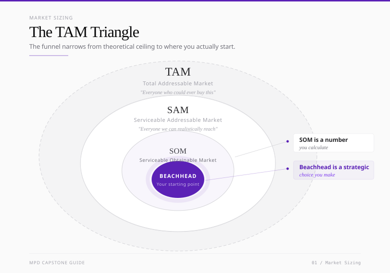
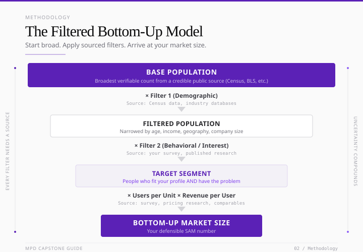
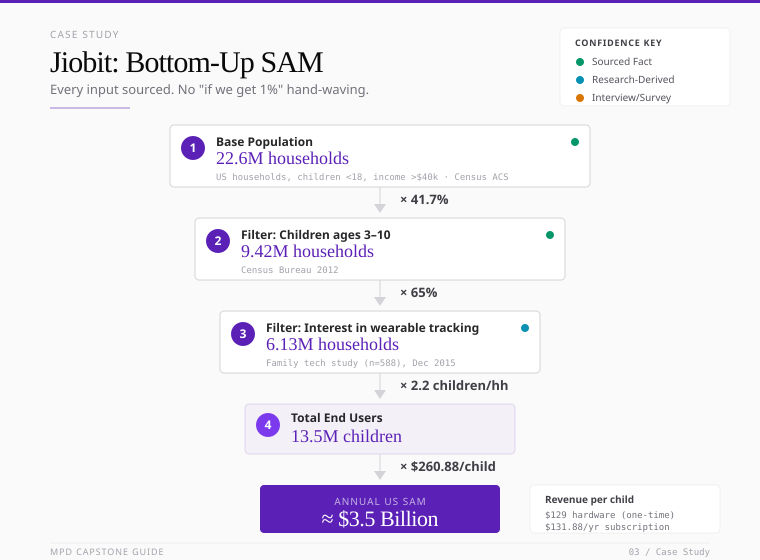
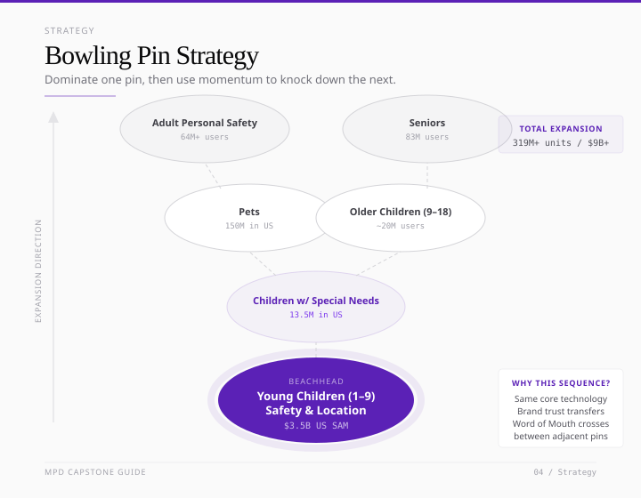
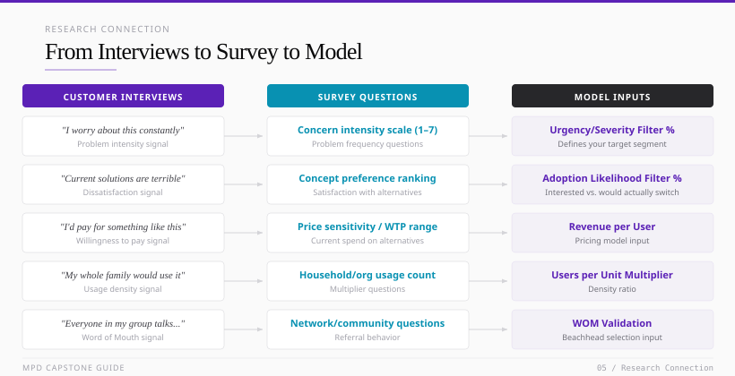
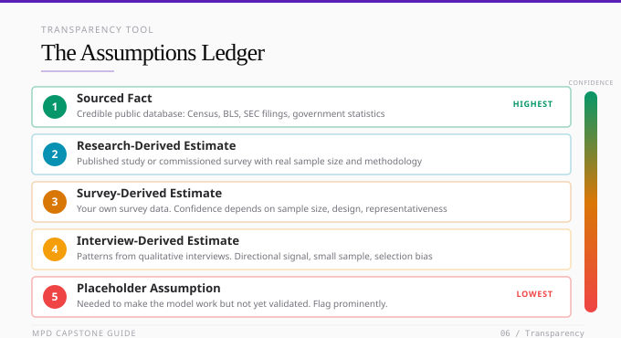
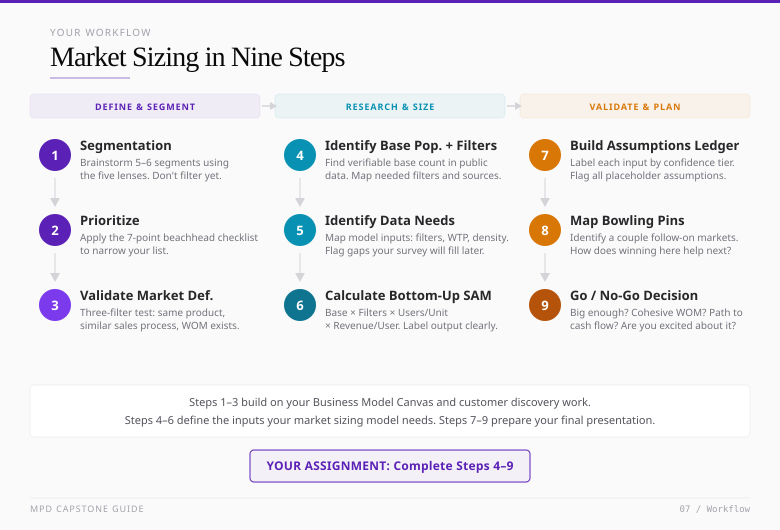

# From Customer Discovery to Market Sizing: A Practical Guide to TAM Analysis and Beachhead Strategy

*A guide for Masters of Product Development & Design students*

---

## How This Guide Fits Into Your Capstone Journey

You've spent the past several months running qualitative customer discovery with Helen, talking to real people, uncovering pain points, and mapping their Jobs to Be Done. In winter quarter you also learned in my class about [Bob Moesta's customer interrogation technique](https://gamma.app/docs/Customer-Discovery-34l6gpd98l5o5y8) (password: presto-w26) - a structured approach to pushing past surface-level answers and getting to the causal stories behind why people actually make decisions. That work gave you something most founders don't have at this stage: direct evidence of how real customers think, what they struggle with, and what triggers them to act. You've also just been introduced to the Business Model Canvas, which gave you a structured way to think about how a business creates, delivers, and captures value.

The next question you need to answer is both simple and hard: **How big is this opportunity, and where exactly do I start?**

This guide walks you through that process. It covers market segmentation, the TAM/SAM/SOM hierarchy, bottom-up market sizing (and why we strongly prefer it), beachhead market selection, and how to connect all of this to the quantitative survey work you'll be doing in the coming weeks. Throughout, I'll use the real-world example of my company Jiobit, to show how these concepts play out in practice.

This guide is the bridge between the qualitative work you've already done with Helen, Jim and Josh and the quantitative validation that comes next.

One note on sequencing: in most startup contexts, you'd validate the business opportunity - sizing the market, confirming willingness to pay, stress-testing the model - before spending months building product. This program deliberately inverts that. Product-first is the right approach for MPD because learning to develop and test product is the core of what you're here for. But it does mean that business viability is catching up to the product work you've already done. Market sizing is where that catch-up happens. Use it as a reality check on the segments you've been exploring, not just as a box to check.

---

## Part 1: Why Market Sizing Matters (And Why Focus Is Everything)

There's a Romanian proverb that applies well to startups: **"The person who chases two rabbits catches neither."**

Many startups fail not because the underlying product idea is bad, but because they diffuse their focus across too many customer segments too early. Their messaging gets diluted. Their sales process becomes a fragmented mess. Their engineering team gets pulled in five directions. Market sizing exists to prevent this. It's not a vanity exercise to impress investors with billion-dollar numbers. It's a strategic reality check that forces you to answer: Who specifically am I building for, and is that group large enough to sustain a business?

If you filled out the "Customer Segments" and "Value Propositions" blocks on your Business Model Canvas, you already started this work. Market sizing takes those blocks and stress-tests them with real numbers.

---

## Part 2: Market Segmentation, Finding Your Tribe

Before you can size a market, you need to define it. Segmentation is the process of subdividing a broad universe of potential customers into groups that share meaningful commonalities. This is where you move from "parents" to "dual-income parents of children ages 3-8 in metro areas who earn $75k+ and are early adopters of connected home technology."

### The Five Segmentation Lenses

You should look at your market through multiple lenses, not just one.

**Geographic.** Where are these customers physically? Starting in a constrained geography limits resource drain and lets you build density. A startup might target Chicago first, not "the United States."

**Demographic.** The countable, observable traits. For consumers, this means age, income, household composition, education. For B2B, it means company size, industry, department, job title. Demographics are your counting tools. You can't "count noses" without them.

**Psychographic.** Demographics tell you *who* the customer is. Psychographics tell you *why* they buy. What are their values, attitudes, and risk tolerances? In B2B, this often comes down to vendor loyalty and willingness to adopt something new. If a company is deeply wedded to a legacy solution and unwilling to change workflows, they aren't a viable early segment regardless of how many of them there are. A concrete example: at Jiobit, parents of children with autism or special needs were a distinct psychographic sub-segment within the broader "parents of young children" demographic. They shared the same ZIP codes and income brackets as everyone else in the market, but their pain signal was fundamentally different - stronger, more urgent, and tied to specific fears that mainstream parents didn't carry the same way. They were willing to pay more, wanted features (like direct integration with 911 dispatch centers) that casual buyers didn't prioritize, and required a completely different acquisition approach and message. Same product. Entirely different customer. If you had lumped them into a single "parents" segment, you would have built messaging that reached no one well and priced in a way that left money on the table.

Here's a second example that surprised us: another psychographic sub-segment at Jiobit turned out to be parents who wanted to give their kids *more* freedom - let them walk to school, play outside unsupervised, roam the neighborhood the way they did when they were kids. The product wasn't about helicopter parenting for these customers. It was almost the opposite. Jiobit was the thing that made it possible to loosen the grip. We heard early signals of this in qualitative research, but it really came into focus during our quantitative work, when we ran needs-based clustering on our survey data and saw these customers separate into a distinct segment with different motivations, different messaging triggers, and different willingness-to-pay profiles. This is exactly what your quant survey can do for you - reveal psychographic segments you sensed in interviews but couldn't yet prove or size. Think back to our class examples I provided for Jiobit and Motomaker.

**Price.** Is your customer seeking a premium/performance solution or a budget/mainstream one? This is a segmentation dimension in its own right and has a big impact on your unit economics and positioning.

**Distribution.** How does this customer buy things? Direct sales, third-party distributors, e-commerce, retail? Selecting a channel that matches existing customer behavior matters. If your target customer doesn't buy online, a DTC model won't work no matter how good your product is.

### The Brainstorming Mandate

In the early phase of segmentation, aim for at least 5-6 potential segments - enough that you're not just picking between two obvious options you already had in mind. Push yourself to think beyond the obvious. Vary the psychographic, vary the use case, vary the price sensitivity. If every segment on your list looks like a slight variation of the same customer, you haven't gone wide enough yet.

But understand why you're doing this. The point of generating multiple options isn't to pursue multiple options - it's to create enough contrast that you're forced to commit to one. Founders who skip this step tend to default to whichever segment they happened to talk to first, or whichever sounds biggest. Going wide first gives you something to actually choose between, which makes the eventual choice defensible rather than arbitrary.

One practical way to pressure-test your top candidates is to try articulating the value proposition for each one separately. If you can't write a crisp, distinct message for a segment - something that would land differently on that specific customer than it would on anyone else - it's a signal the segment isn't defined tightly enough yet. In class, you'll do this by building short landing pages for two or three of your candidate segments. The exercise forces a kind of clarity that a spreadsheet or a slide can't: you either have something specific and true to say to this person, or you don't. Teams often discover in this exercise that two segments they thought were distinct actually collapse into the same message, which tells them something important about how their segmentation is drawn.

As you generate candidates, pay particular attention to the psychographic dimension - the *why* behind the purchase. Demographics tell you who the customer is and help you count them. Psychographics tell you why they buy, and that's what determines whether they talk to each other. A tightly defined psychographic almost always maps to a community: industry forums, trade shows, mom blogs, Reddit threads, Slack groups, secret Facebook groups. That community is where Word of Mouth lives. If you can't picture where your target customer gathers and talks, your psychographic isn't crisp enough yet. You'll filter ruthlessly in the next step - right now, you want a full picture to choose from.

### Synthesizing Into a Persona

When you layer these lenses together, you get a persona, the specific human archetype you're building for. This is the same persona concept you encountered in customer discovery, but now grounded in segmentation data. A clear persona gives you three things: focus on a specific high-value use case, messaging that speaks directly to one person's pain, and a repeatable sales process that works the same way every time.

### What Makes a Segment Actionable?

Not every segment you brainstorm will be worth pursuing. As you learned in Professor Cahill's class, Kotler and Keller identify five criteria that separate a real, workable segment from a conceptual one (MPD406, Session 03):

**Differentiable.** The segment should be distinguishable in terms of needs or responses to your marketing mix. If two segments respond to the same message and buy for the same reasons, they're really one segment. Remember our lecture slide on customer's sharing the same BUYING PATTERNS.

**Measurable.** You need to be able to estimate the segment's size and purchasing power. If you can't count them or approximate a number, you can't size the market.

**Accessible.** Can you actually reach and serve this segment through your available channels? A segment that exists in theory but can't be targeted through any practical distribution or marketing channel isn't useful.

**Substantial.** The segment must be large enough and profitable enough to be worth serving. This connects directly to the beachhead sizing work you'll do later - a segment that fails this test won't sustain a business.

**Actionable.** You need to be able to design an effective marketing program for this segment. If you can identify them but can't figure out how to reach them differently from everyone else, the segmentation isn't driving action.

These five criteria are a good gut check before you invest time sizing a segment. If it fails on measurability, your bottom-up model will be built on guesses. If it fails on accessibility, your SOM will be near zero regardless of how large the SAM looks on paper.

---

## Part 3: The TAM Triangle, TAM, SAM, and SOM

Market sizing uses a three-level hierarchy, a funnel that narrows from "the entire universe" down to "where we're starting."

**TAM (Total Addressable Market)** is the broadest circle. It represents the total revenue opportunity if you captured 100% of every possible customer for your product category. This is the theoretical ceiling, useful for understanding the scale of the space, but not where you should spend your time.

**SAM (Serviceable Addressable Market)** is the subset of the TAM you could realistically reach given your current business model, geography, pricing, and distribution constraints. If you're a US-only company, the European portion of the TAM isn't in your SAM. If your product requires $100k+ household income, lower-income households aren't in your SAM.

**SOM (Serviceable Obtainable Market)** is the share of the SAM you can realistically capture in a given time period, typically your first 1–3 years.

A related but distinct concept is your **Beachhead Market** (sometimes called your Target Market), the specific, narrowly defined sub-segment you will attack first. Your beachhead is a strategic choice about *where to focus*; your SOM is a realistic estimate of *how much you can win there*. In practice they're closely related, your SOM is usually defined by and within your beachhead, but it's worth understanding the difference. A beachhead is a segment you choose; a SOM is a number you calculate.

### What Makes a Segment a Real Market?

Not every group of people with something in common qualifies as a market. A segment only counts as a viable market if it passes three filters:

1. **The customers buy the same product.** Your core solution doesn't require major customization from one customer to the next.
2. **The customers have a similar sales process.** Same persona, same value proposition, same decision-making unit and process.
3. **Word of Mouth exists between customers.** They talk to each other. This is your strongest scaling mechanism. If customers don't reference each other, you're stuck paying full acquisition cost for every single one. "Word of Mouth" can take many forms: literal referrals, visible peer adoption, professional communities and conferences, online forums, or simply being "referenceable" to others in the segment.

### A Common Beginner Mistake

New founders tend to chase the biggest number. But a beachhead can actually be *too big*. If your initial target market is $500M, Word of Mouth gets diluted across too many sub-groups, and you can't achieve the concentration needed to dominate. A common venture strategy heuristic is that your beachhead should be around $100M or less, small enough to dominate, large enough to sustain you. That's not a hard rule (the right size depends on your category, sales cycle, and unit economics), but it's a useful starting point. Winning 100% of a $10M market is often a better strategic position than having 0.1% of a $10B market.

---

## Part 4: Top-Down vs. Bottom-Up Analysis, Why We Strongly Prefer Bottom-Up

This is one of the most important distinctions in this guide.

### Top-Down Analysis

Top-down analysis starts with a big number from a secondary research report, an analyst estimate, an industry forecast, a government statistic, and then assumes you'll capture some percentage of it.

It typically sounds like: *"The global child safety market is $15B. If we capture just 1% of that, we have a $150M business."*

That 1% is completely made up. There's no evidence behind it. You haven't validated that customers exist, that they'd pay your price, or that you can reach them. Top-down analysis is built on assumptions stacked on top of other assumptions. For existing, well-established markets with good historical data, top-down can provide a useful sanity check. But for new products, new categories, or anything genuinely innovative, secondary data for your specific problem often doesn't exist yet.

**When top-down works (somewhat):** Existing markets being re-segmented, or "clone" products entering established categories with well-documented spending data.

**When top-down fails:** New products, new categories, and breakthrough innovations where no analyst report covers your specific value proposition - and in some cases, where the category itself doesn't exist yet. If you're creating a genuinely new market, there is no secondary data to reference. There's no report to slice because no one has measured it. Top-down analysis requires a pre-existing market to measure; bottom-up doesn't.

### Bottom-Up Analysis

Bottom-up analysis starts at ground level with real customers and builds upward. You start with a verifiable base population, apply filters grounded in primary and secondary research, determine what customers would actually pay, and build your market size from those specific inputs.

It's harder and more time-consuming. That's exactly why it's more valuable and more credible.

Bottom-up analysis is anchored in the primary research you've already been doing through customer discovery. It tells you whether real people have this problem, how concentrated they are, and what they would actually pay. The answers come from evidence, not assumptions.

An important clarification: "bottom-up" doesn't mean you can *only* use primary research. In practice, bottom-up models typically combine primary research (for behavior, pricing, interest levels, and conversion assumptions) with secondary/public data (for total population counts like Census figures, industry databases, and government statistics). What makes it bottom-up is that the model is built from customer-level units and unit economics upward, rather than slicing a percentage off an analyst's top-line number.

### A Side-by-Side Comparison

| Dimension | Top-Down | Bottom-Up |
|---|---|---|
| **Data source** | Secondary research, analyst reports, industry stats | Primary research combined with verifiable public data |
| **Process** | Take a big number, assume a market share % | Count actual users, apply filters, extrapolate |
| **Best for** | Established markets with good historical data | New products, new categories, innovative solutions |
| **Effort required** | Low, desk research | High, field work, stakeholder interviews |
| **Credibility** | Lower for new ventures, built on assumptions | Higher, anchored in observed reality |
| **What it reveals** | A broad "size of the bucket" | Validated pricing, competitive differentiation, real buying triggers |

**The bottom line:** For your capstone projects, bottom-up analysis should be your primary methodology. Top-down figures can still be directionally useful for category context, investor framing, or as a sanity check, but the bottom-up number is the one you'll defend.

---

## Part 5: The Bottom-Up Method, How to Actually Size Your Market

You can't count every potential customer in your market. That would be impossibly expensive and time-consuming. Instead, you build a model from verifiable inputs. There are two main approaches, and the one you choose depends on your product and what data you can access.

### Approach A: The Filtered Bottom-Up Model (Recommended for Most Capstone Projects)

This is the approach most of you will use. It works especially well for consumer products and for any project where you have access to public demographic data and can field a survey to validate your key assumptions.

The logic: start with a large, verifiable base population, then apply a series of evidence-based filters to narrow it down to your actual target market. Each filter should be sourced, from Census data, industry databases, published research, or your own survey results. Then multiply by revenue per user to get your market size.

**Step 1: Identify Your Base Population**

Start with the broadest verifiable count of the group your product serves. This should come from a credible public source: U.S. Census, Bureau of Labor Statistics, industry associations, etc. Examples: total US households with children under 18, total US companies with 50+ employees, total registered pet owners in the US.

**Step 2: Apply Demographic and Behavioral Filters**

Narrow the base population using filters grounded in data. Each filter represents a segmentation choice you've made and should be sourced. Typical filters include age range, income bracket, geography, relevant behavior or ownership (e.g., "already owns connected home devices"), and stated interest or problem severity.

The key discipline: every filter needs a source. Census data, published studies, industry reports, and your own survey results are all valid sources. What's not valid is making up a percentage because it "feels right."

**Step 3: Estimate Users Per Unit**

If your product serves multiple people within a household, company, or organization, apply a multiplier. This number should also be sourced, whether from Census average household size, survey data on how many people in the household would use the product, or similar.

**Step 4: Determine Revenue Per User**

Do not guess this number. Triangulate from multiple data points:

*One-Time Charge Data.* What would you charge per unit, how many units does each user need, and what's the product lifecycle? Annualize it: (Price × Units per user) ÷ Product life in years.

*Budget Available Data.* What does the customer currently spend on alternatives or related solutions? What's their total relevant budget, and what percentage could your solution capture?

*Comparables.* What do similar products in adjacent markets charge? Convert their pricing to an annualized per-user figure for benchmarking.

If the budget data comes in lower than your one-time charge calculation, you have a pricing or value proposition problem. If your one-time charge is well below comparables, you may be underpricing.

An important distinction: there's a difference between what people *say* they'd pay (stated willingness to pay), what they *currently spend* on alternatives (revealed spend), and what you'll *actually realize* after discounts, churn, and channel costs (realized price). Your survey will capture the first two; the third requires assumptions you should flag explicitly.

**Step 5: Calculate the Market Size**

The math:

> **Base Population** × **Filter 1** × **Filter 2** × ... × **Users per Unit** = **Total End Users**
>
> **Total End Users** × **Annualized Revenue per User** = **Bottom-Up Market Size**

### Approach B: The End-User Density Model (Best for B2B or Niche Markets)

There's a second bottom-up technique that works well for B2B products or any market where your target users are "hidden" inside larger organizations. Instead of filtering a broad population, you measure **End-User Density**, the concentration of target users within a representative unit, and then extrapolate.

SensAble Technologies used this approach to size their market for haptic design devices. They couldn't find a database of every industrial designer in the world. But they could find the total number of employees at target firms (their **Countable Unit**). By visiting a few firms and counting how many industrial designers existed per 1,000 employees (the **density ratio**), they could extrapolate across the entire industry.

**How it works:**

Choose a **Countable Unit**, a broader, verifiable entity that contains your target users. For B2B: total employees, annual revenue, number of products shipped. For B2C: households in a ZIP code, members of a specific community or organization.

Stress-test your unit: Can you find the total count in a public database? Is the link between the unit and your end users logical? Is the definition consistent across segments?

**Count noses in at least three instances.** Visit, call, or survey three specific examples of your countable unit and measure how many target users exist within each one. Three is a pragmatic minimum for an early-stage estimate. It's enough to spot whether your density ratio is consistent or whether there's high variance suggesting a fragmented market or a poorly chosen unit. To be clear, three instances are a starting point, not a basis for statistical confidence. If variance is high, gather more data or revisit your segmentation.

**Calculate the density ratio** for each instance (end users ÷ total unit size), derive a reasonable average, and extrapolate across the total countable units in the broader market.

**The formula is the same:**

> **Density Ratio** × **Total Countable Units in Market** = **Total End Users**
>
> **Total End Users** × **Annualized Revenue per User** = **Bottom-Up TAM**

### Which Approach Should You Use?

For most capstone projects, especially consumer products, **Approach A (filtered bottom-up)** will be your primary method. It maps directly to your survey instrument: the survey provides the filter percentages (interest level, problem severity, willingness to pay) while public data provides the base population counts.

If your project is B2B and your target users are embedded inside larger organizations, **Approach B (end-user density)** may be more appropriate. You can also embed density-style questions directly into your survey (e.g., "How many people in your organization currently perform [target task]?") to get density data without needing separate site visits.

Either way, the underlying principle is the same: build from the ground level using sourced inputs, not from the top down using assumed market share percentages.

---

## Part 6: Jiobit, A Real-World Bottom-Up Example

To make this concrete, let's walk through how Jiobit, a small, discreet GPS location tracker for young children, built its market sizing from the ground up.

### The Problem (What Customer Discovery Revealed)

Through extensive qualitative interviews and quant surveys with parents across the country, a clear pattern emerged: almost every parent had a story about losing track of their child, even briefly. The emotional intensity was extreme. Parents described feeling physically ill, unable to breathe, holding their child so tight they made them cry. This wasn't a "nice-to-have" problem. It was visceral.

Parents also expressed deep dissatisfaction with existing solutions. Bluetooth trackers only worked within 30 feet. Kids' smartwatches were too bulky for children under 8 and often restricted by school policies. Existing GPS trackers were clunky, had terrible battery life, poor data security, and cost $30/month. Smartphones weren't appropriate for young children.

What parents wanted, something small, discreet, long battery life, accurate real-time location, secure, simply didn't exist. This is a textbook market opportunity. (Market opportunities don't always require that nothing exists. They can also arise from making something dramatically better, cheaper, more accessible, or more convenient than existing options.)

### The Segmentation

Jiobit's segmentation layered multiple dimensions. Demographically, the target was households with children roughly ages 3–10 with income above $40k (later refined to $50k+). Psychographically, these were parents comfortable with connected technology and motivated by safety. The survey data showed that willingness to invest in child safety wearables scored higher than interest in Nest thermostats, Ring doorbells, or Fitbit trackers. Geographically, the initial focus was the US market.

### The Filtered Bottom-Up SAM Calculation

Here's how Jiobit sized its US Serviceable Addressable Market (SAM) using the filtered bottom-up approach, with each input sourced from public data or primary research:

**Base Population:** US households with children under 18 and income above $40k.
Source: U.S. Census Bureau, 2009–2013 5-Year American Community Survey. **Count: 22.6 million households.**

**Filter 1 (Demographic):** Estimated percentage of those households with children in the target age range (3–10).
Source: Data calculations from U.S. Census Bureau, 2012 Census. **Filter: 41.7%**

**Filter 2 (Behavioral/Interest):** Percentage of parents who expressed interest in wearable technology for tracking children.
Source: Independent children and family technology study (n=588), December 2015. **Filter: 65%**

This yields **6.13 million households** in the target segment.

**Users per household:** 2.2 children per household on average. This is the average number of children in qualifying households, not all US children. Ideally, this multiplier should represent target-age children per household rather than all children. If a household has one 5-year-old and one 14-year-old, only the 5-year-old is in the immediate beachhead. When you build your own model, be precise about what your multiplier counts.

**Revenue per user:** $129 hardware + $131.88/year in software subscription = **$260.88 per child.** A note on this number: hardware revenue is one-time while the subscription is recurring. For market sizing purposes, Jiobit used a Year 1 model combining the initial hardware purchase with the first year of subscription. For a multi-year view, you'd spread the hardware cost (amortize it) over the product's expected lifetime and add annual subscription revenue. For your capstone, pick one approach and be explicit about which year you're modeling.

**Annual Potential US SAM:** 6.13M households × 2.2 children × $260.88 = **approximately $3.5 billion.**

Notice what makes this credible compared to a top-down approach. Every single input is sourced: Census data, a commissioned survey with a real sample size, actual pricing. There's no "if we get 1% of the market" hand-waving. The 65% interest figure came from a quantitative study, not an assumption. The pricing came from competitive analysis and willingness-to-pay research.

Also notice: this is the SAM (Serviceable Addressable Market), not the TAM. Jiobit already filtered by geography (US only) and income ($40k+), which means portions of the total addressable universe are excluded. A broader TAM would include international markets and lower income brackets. Being precise about which level of the hierarchy you're calculating prevents confusion. Label your output clearly.

**A word of caution on compounding filters.** Each filter you apply carries some uncertainty. When you multiply uncertain percentages together, the uncertainty compounds. The Jiobit model uses three main filters (age range, interest level, household income), each from a credible source. But if you're stacking five or six filters and some are rough estimates, your final number could be materially off. Mark each assumption by its confidence level (see the Assumptions Ledger below) and be honest about which filters are strongest and which are softest.

### The Beachhead and Follow-On Markets (Bowling Pin Strategy)

Jiobit didn't try to attack the entire $3.5B SAM on day one. The beachhead was the core use case: safety and real-time location for young children (ages 1–9) in higher-income US households. This segment had the strongest emotional urgency, the clearest product-market fit, and the highest Word of Mouth potential. Parents of young children talk to each other constantly.

From that beachhead, Jiobit mapped out follow-on markets, adjacent "bowling pins" that could be knocked down using the same core technology and brand trust:

- **Children with special needs** (13.5M in the US), same product, adjacent customer
- **Pets** (150M in the US), same product, new customer segment
- **Older children ages 9–18** (~20M in the US), evolved product, same family relationship
- **Adult personal safety** (64M+), extended product, new customer segment
- **Seniors** (83M), extended product, new customer segment

Together, these follow-on markets represented a rough expansion map of over 319 million potential units and $9B+ in annual revenue in the US alone. These categories overlap and mix people with pets, so this isn't a deduplicated total. It's a directional view of how large the opportunity could become. The $9B figure uses different price points per segment (pets and seniors carry different unit economics than the core child product), so don't try to derive it by multiplying 319M by the $260 child figure. The key strategic insight was sequencing: dominate the beachhead first, build the brand and infrastructure, then expand.

Jiobit also mapped a "Hierarchy of Needs," starting with the foundational need (safety and location for little ones), then layering on additional services over time: pet tracking, senior safety, home safety, carpooling and scheduling, insurance partnerships, and financial tools. Each layer built on the trust established in the layer below.

### How the TAM Expands Through Jobs to Be Done

Consider how this played out at Jiobit. The beachhead was parents of young children - a focused segment with concentrated Word of Mouth and a clear, urgent problem. But the job to be done - keeping track of someone you're responsible for who can't fully keep track of themselves - doesn't stop at children. Parents who already owned a Jiobit also owned pets. Same household, same customer, no reacquisition cost, same underlying job. That's the next bowling pin. And what happens to children as they age? Their parents age too. Elderly parents who wander, who have dementia, who live independently but need a safety net - same job again. The TAM expands not by chasing unrelated markets but by asking: what other people or situations would hire this same job? That question, not a market report, is what should drive your roadmap.

---

## Part 7: Selecting Your Beachhead, The 7-Point Checklist

Your beachhead is your "lead pin" in the bowling alley. Here's how to evaluate candidates:

**1. Well-Funded Customer.** Do they actually have money to pay? A segment full of people who love your product but can't afford it isn't a viable beachhead. Jiobit targeted $50k+ income households for this reason.

**2. Readily Accessible.** Can you reach them directly? If you need to go through three layers of intermediaries or unproven channels, you'll burn cash before you learn anything. Early on, you need direct feedback loops.

**3. Compelling Reason to Buy.** Is this a "must-have" or a "nice-to-have"? Your biggest competitor is almost always the customer doing nothing. Jiobit's advantage was that the pain of not knowing where your child is was so intense that "doing nothing" felt unacceptable to the target parent.

**4. Whole Product Delivery.** Can you provide a complete, functional solution? Nobody wants to buy an "alternator." They want the car. If your product requires the customer to assemble five other pieces before it works, you have a whole-product problem.

**5. No Entrenched Competition.** Is there a dominant incumbent that could block you regardless of how good your product is? Jiobit's competitive landscape was fragmented (Bluetooth trackers, bulky GPS devices, smartwatches) with no single dominant player owning the specific use case.

**6. Strategic Follow-On (Lead Pin Logic).** Does winning this market make the next market easier? Jiobit's child safety beachhead built a brand around "family safety" that naturally extended to pets, seniors, and adults. Each follow-on market used the same core technology and trust.

**7. Team Passion and Values.** Is the founding team prepared to live in this market for the next 5+ years? If the answer is no, the TAM is irrelevant. This is the most underrated filter and arguably the most important. If you don't care deeply about the problem, the journey won't be sustainable.

**The Cash Flow Test:** Your beachhead must provide a credible path to cash-flow positivity within approximately three years. If the math doesn't work, re-evaluate the segment.

---

## Part 8: Assessing Market Health, Beyond the Raw Number

A big TAM number by itself is meaningless. You need to evaluate the quality of the opportunity through four additional lenses:

**Profitability Range.** What are the margins in this segment? A $10M market with 80% margins can be far more attractive than a $100M market with 2% margins.

**CAGR (Compound Annual Growth Rate).** Is this market expanding or contracting? A 30% annual growth rate means the opportunity is getting bigger every year. A shrinking market means you're fighting over a diminishing pie.

**Time to 20% Market Share.** How quickly can you reach a dominant position? The longer it takes, the more capital you need and the more exposure you have to competitive response.

**Anticipated Maximum Market Share.** What percentage can you realistically hold? In some markets, a single player can capture 60%+. In others, the ceiling is 15%.

---

## Part 9: Connecting to Your Quantitative Survey Work

In about two weeks, you'll begin designing and fielding a quantitative survey based on what you learned with Professor Cahill from the fall quarter. This survey is where your qualitative customer discovery work becomes quantitative market sizing data. It's the instrument that powers your filtered bottom-up model.

### From Interviews to Survey: The Translation Layer

A common pitfall for first-time researchers is designing a survey from a blank page, disconnected from what they already learned in interviews. Your survey should be validating and quantifying patterns you've already observed. If you used Bob Moesta's interrogation technique well, you've already pushed past the surface-level answers and into the causal stories - the specific moments, frustrations, and tradeoffs that actually drove behavior. Those causal patterns are exactly what your survey should be testing at scale. Here's how interview insights translate into survey variables and, ultimately, into market sizing inputs:

| What you heard in interviews | Survey question type | What it feeds in your model |
|---|---|---|
| "I worry about this constantly" / "This happens to me all the time" | Problem frequency or concern intensity scale (e.g., 1–7 scale) | Urgency/severity filter, helps define who's in your target segment vs. who's a casual observer |
| "Current solutions are terrible" / "I've tried X and it doesn't work" | Concept preference, feature ranking, satisfaction with alternatives | Adoption likelihood filter, separates "interested" from "would actually switch" |
| "I'd definitely pay for something like this" / "I spend $X on workarounds" | Price sensitivity questions, willingness-to-pay range, current spend on alternatives | Revenue per user input |
| "My whole family / team / department would use this" | Household/org usage multiplier questions | Users per unit multiplier |
| "Everyone in my [mommy group / Slack community / industry meetup] talks about this" | Network/community questions | Word of Mouth validation for beachhead selection |

The key principle: your survey should validate patterns from your interviews, not start from scratch. Every question should connect to either a filter in your market sizing model or a pricing input.

### Willingness to Pay Questions

Your customer discovery interviews gave you qualitative signals about what people value and what they'd consider paying. The survey lets you quantify those signals across a larger sample. You'll be testing price sensitivity, feature prioritization, and the gap between "interested" and "willing to commit money."

### Density and Filter Questions

Your survey should include questions that directly feed your bottom-up model's filters. For consumer products, these might include screening questions that establish whether the respondent fits your target demographic, questions about problem frequency and severity (which become your "interest" or "need" filter percentages), and household-level multiplier questions (how many people would use this product?).

For B2B projects, you can embed density-style questions: How many people in your organization currently perform [target task]? What is the total headcount of your department/division/company? These give you an end-user density ratio from survey data rather than requiring separate site visits.

### Designing for Both Purposes

When you build your survey instrument, think about it as serving your bottom-up market sizing directly. The willingness-to-pay questions give you your "annualized revenue per user" input. The screening and filter questions give you the percentages that narrow your base population. The density/multiplier questions tell you how many users exist per unit. Together, they feed the bottom-up formula:

> Base Population × Filter % × Filter % × Users per Unit × Revenue per User = Market Size

This is why we're combining these efforts. You get more value from a single well-designed survey than from two separate, thinner studies.

### Survey Design Checklist

Before you finalize your survey, confirm that you can answer these questions: Which specific interview hypotheses am I testing? Which questions are screeners (defining who's in my target segment)? Which variables drive my market sizing filters? Which variables drive my pricing model? What decision will each answer inform, and if I can't name the decision, should the question be in the survey at all?

### Using Cluster Analysis to Discover Segments You Didn't Know You Had

Your qualitative interviews will give you a working hypothesis about who your customer segments are. But some of the most important segments only become visible when you have quantitative data and can run cluster analysis across your survey responses.

As you learned in Professor Cahill's class (MPD406, Sessions 02-03), the process works like this: qualitative research generates hypotheses about what dimensions matter - benefits sought, goals, attitudes, trust levels, usage behavior. You then design survey questions to capture those dimensions quantitatively, typically using Likert scales (agreement/disagreement on a set of related statements) and behavioral frequency measures. Once you have the data, cluster analysis groups your respondents based on patterns in their answers - not based on demographics, but based on what they need, what they value, and how they behave. Demographics come in afterward, when you run crosstabs to profile each cluster and figure out who these people are in countable terms.

This is a critical distinction. Demographics tell you who someone is. Needs-based clustering tells you why they buy. Two people with identical demographic profiles can land in completely different clusters because they have fundamentally different motivations. That's exactly what happened at Jiobit - the "safety-anxious" parents and the "freedom-seeking" parents looked the same on paper (same age ranges, same income brackets, same household composition), but their purchase motivations, messaging triggers, and willingness-to-pay profiles were different enough that they separated cleanly in the data.

The All Nutrition case from Professor Cahill's class (MPD406, Session 03) illustrates the same pattern. Focus groups initially surfaced six potential customer segments - High Performance, Advanced Hardcore, Advanced Healthy, Newbie Cautious, Newbie Credulous, and Health Compelled - based on the intersection of expertise level and attitude toward supplements. Those hypothesized segments then got validated through a quantitative survey designed around five question domains: benefits sought, goals, trust and expertise, attitudes and emotions, and customer profile. The survey didn't just confirm the segments existed - it sized them, profiled them demographically, and revealed which ones were large enough and distinct enough to target.

When you design your own survey using what you learned with Professor Cahill, think about it in these terms. Your interview work with Helen gave you the hypothesis. Your survey gives you the data to test it. And cluster analysis is the tool that lets the data show you whether your hypothesized segments hold up - and whether there are segments hiding in the data that you didn't anticipate. Design your questions to cover benefits, goals, attitudes, behavioral frequency, and customer profile so you have enough dimensions for meaningful clustering.

---

## Part 10: Common Mistakes and the Assumptions Ledger

### Mistakes to Avoid

As you work through your market sizing, watch out for these common traps:

**Using percentages with no evidence.** "We think 20% of people would buy this" is not a data point. It's a guess dressed up as a number. Every percentage in your model needs a source.

**Confusing "interested" with "will buy."** Survey respondents who say "I'd definitely be interested" are not the same as people who will pull out a credit card. Interest is always higher than adoption. Build in a realistic conversion discount.

**Counting everyone who has the problem instead of everyone you can reach.** Market size isn't "all people with this pain." It's the people you can actually get your product in front of through your chosen channels, at your price point, in your timeframe.

**Mixing users, buyers, and households.** Be precise about what you're counting. One household might have two users but one buyer. One company might have 50 users but one procurement decision. Sloppy unit definitions compound errors throughout the model.

**Forgetting to annualize revenue consistently.** If some of your revenue is one-time (hardware) and some is recurring (subscription), pick a clear time frame and be explicit about it. Mixing annual and lifetime numbers in the same model produces inflated or deflated figures.

**Multiplying too many uncertain estimates.** Each uncertain filter compounds the uncertainty of the ones before it. Three filters with decent sources is much better than six filters where half are guesses.

**The double-counting trap.** Be careful with overlapping filters. If you apply Filter A (household income > $100k) and then Filter B (luxury car owners), you may be shrinking your market twice for the same attribute, since luxury car ownership is largely a subset of high-income households. Before stacking filters, ask yourself: is this filter independent of the ones I've already applied, or does it overlap?

### The Assumptions Ledger

Engineers show their work. You should too. For every input in your market sizing model, label it by confidence level:

**Sourced fact.** Comes directly from a credible public database (Census, BLS, SEC filings). Highest confidence.

**Research-derived estimate.** Comes from a published study or commissioned survey with a real sample size. High confidence, but dependent on methodology and sample quality.

**Survey-derived estimate.** Comes from your own survey data. Confidence depends on sample size, question design, and how well your sample represents the broader market.

**Interview-derived estimate.** Comes from patterns observed across your qualitative interviews. Useful directional signal, but small sample and subject to selection bias.

**Placeholder assumption.** A number you needed to make the model work but haven't validated yet. Lowest confidence. Flag these prominently and plan to replace them with real data.

When you present your market sizing, the assumptions ledger makes it immediately clear which parts of your model are solid and which are educated guesses. Investors and advisors will respect this transparency far more than a model that presents every number with equal confidence.

**Practical tip for presentations:** Consider color-coding your spreadsheet or slides. Green for sourced facts, yellow for survey/interview-derived estimates, red for placeholder assumptions. This forces you to visually confront where your model is strongest and weakest before you present it.

---

## Part 11: The Go/No-Go Decision

After completing your segmentation, beachhead selection, and bottom-up TAM analysis, you need to make an honest assessment. Run through these four gates:

**Is the market big enough to be interesting, yet small enough to dominate?** If your beachhead is $5B, you can't concentrate Word of Mouth. If it's $500k, you can't build a sustainable business.

**Is the segment cohesive enough for meaningful Word of Mouth?** Do these customers talk to each other? Are they in the same communities, conferences, forums, schools? If they're completely isolated from one another, organic growth will be nearly impossible.

**Is there a credible path to positive cash flow within three years?** Run the numbers honestly. Account for customer acquisition cost, product development cost, and realistic conversion rates.

**Do you feel good about this?** This is not a throwaway question. If you've done rigorous analysis and the beachhead still doesn't excite you, if you can't imagine spending years on this problem, trust that instinct. It is far better to discover a market's shortcomings on paper than after you've spent your capital.

If any answer is "no," go back and re-evaluate. That's not failure. It's the process working.

---

## Part 12: Putting It All Together, Your Workflow

Here's how all of these pieces connect in sequence:

**Step 1, Segmentation.** Using the five lenses (geographic, demographic, psychographic, price, distribution), brainstorm at least 10–12 potential market segments. Don't filter yet.

**Step 2, Prioritization.** Apply the 7-point beachhead checklist to narrow your list. Look for segments with funded customers, direct accessibility, compelling reasons to buy, and strategic follow-on into adjacent markets.

**Step 3, Validate the market definition.** Confirm your top candidate passes the three-filter test: same product, similar sales process, and Word of Mouth between customers.

**Step 4, Identify your base population and filters.** Find the verifiable base population count in a public database. Map out the demographic and behavioral filters you'll need to narrow it to your target segment. Note which filters you already have sources for and which your survey will need to provide.

**Step 5, Design your quant survey.** Build in screening questions (to establish your filter percentages), willingness-to-pay questions (to establish revenue per user), and density/multiplier questions (to establish users per unit). Every question should connect to a specific input in your bottom-up model.

**Step 6, Calculate your bottom-up SAM and beachhead size.** Apply the filtered bottom-up formula: Base Population × Filters × Users per Unit × Revenue per User. Label your output clearly (TAM, SAM, or beachhead). Compare against any available top-down data as a sanity check.

**Step 7, Build your assumptions ledger.** Label every input by confidence level. Flag placeholder assumptions that need further validation.

**Step 8, Map your bowling pins.** Identify 3–5 follow-on markets and articulate how winning the beachhead makes each one easier to capture.

**Step 9, Run the Go/No-Go assessment.** Be honest with yourself. Adjust or pivot if needed.

### Where This Goes Next

A note on where this goes next: The bottom-up model you're building here is not a standalone deliverable. It's the market input to your financial model - the 10-week operating system of your business that you'll be developing alongside this coursework. Your base population, your filter percentages, your revenue-per-user assumptions - all of these will become live variables in that model. As you collect survey data and refine your customer discovery, you'll update them. The market sizing work you do now is the first draft; the financial model is where it gets stress-tested over time.

### A Note on B2B vs. B2C Projects

Most of the examples in this guide lean consumer (B2C). If your capstone project is B2B, keep in mind that "user," "buyer," and "economic decision-maker" can be different people. The person who uses your product daily may not be the person who signs the purchase order. Your survey needs to account for this by asking about both usage patterns (density) and purchasing authority (who decides, what's the budget). Your market sizing should count the unit that matters for revenue: typically the buyer or the contract, not just the end user.

---

## Quick Reference: Key Terms

**TAM (Total Addressable Market).** Total revenue opportunity at 100% market share. The theoretical ceiling.

**SAM (Serviceable Addressable Market).** The portion of TAM reachable with your current business model, geography, and constraints.

**SOM (Serviceable Obtainable Market).** The realistic share of your SAM you can capture in a given time period (typically 1–3 years). Often closely tied to your beachhead market, but SOM is a number while the beachhead is a strategic segment choice.

**Beachhead Market.** A narrow niche where you establish a defensible position before expanding.

**Countable Unit.** The verifiable proxy entity (households, companies, etc.) used to estimate end-user density.

**End-User Density.** The ratio of target users within a countable unit. The core of bottom-up analysis.

**Bowling Pin Strategy.** Dominate one niche (the lead pin), then use that momentum and credibility to expand into adjacent markets.

**ICP (Ideal Customer Profile).** The specific description of the customer who gets the most value from your product and whom you can serve most efficiently.

**Word of Mouth (WOM).** Organic referral between customers in a segment. The strongest and cheapest scaling mechanism for a startup.

**CAC (Customer Acquisition Cost).** What it costs you to acquire one customer. Focus reduces it; diffusion inflates it.

**LTV (Lifetime Value).** Total revenue a customer generates over their relationship with you. A tailored product-market fit increases it.

**CAGR (Compound Annual Growth Rate).** The annualized growth rate of a market over a period of time.

**DMU (Decision Making Unit).** The person or group that makes the purchasing decision.

**Whole Product.** The complete solution the customer needs, not just your core technology. Includes services, integrations, support, everything required for the product to deliver its full value.

**Filtered Bottom-Up Model.** A bottom-up sizing approach where you start with a verifiable base population and apply sourced filters (demographic, behavioral, interest) to narrow to your target market. The primary method recommended for most capstone projects.

**Assumptions Ledger.** A transparency tool where you label each input in your model by confidence level (sourced fact, research-derived, survey-derived, interview-derived, or placeholder assumption).
